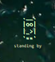

# Codex ASCII Companion

Codex ASCII Companion is a transparent Windows desktop companion that turns local Codex activity into a tiny ambient UI.

This is a small supporting utility: useful as a local workflow companion, not a full productivity platform.

Instead of another dashboard, it lives near the system clock and reflects the state of the local Codex runtime with lightweight ASCII animation. The companion watches the real `codex.exe app-server` process tree, so it reacts to actual work rather than simply checking whether the Codex app window is open.

## Preview



The live pod is intentionally tiny on screen, and the screenshot reflects its real desktop scale.

## What This Repo Demonstrates

- Translating noisy local runtime signals into a calm, readable desktop presence
- Distinguishing real work states such as `thinking`, `tooling`, `building`, and `waiting`
- Keeping the always-on surface intentionally tiny while exposing deeper diagnostics separately
- Shipping a lightweight desktop utility with standard-library Python plus `tkinter`

## Features

- Transparent always-on-top companion pod with tiny ASCII state art
- Runtime-aware sensing based on Codex process activity
- Confidence-gated state selection so weak signals stay `idle`
- Optional diagnostics window for rollout reasoning hits, process hints, and recent trace decisions
- Docking, pause/resume, caption toggle, and theme-aware styling
- Lightweight local actions that can be adapted or removed for a different setup

## Requirements

- Windows
- Codex installed locally
- Python 3 with `pythonw.exe` available

## Run

Use the Desktop shortcut, or run:

```powershell
pythonw .\codex_ascii_companion.pyw
```

For diagnostics on launch:

```powershell
pythonw .\codex_ascii_companion.pyw --debug
```

For a clean restart:

```powershell
.\relaunch_companion.ps1
```

## Interaction Model

- Left click: brief acknowledgement animation
- Double click: redock above the clock
- Right click: open the companion menu
- Pause/resume: clear stale snapshots and force a fresh resync against the current Codex process tree
- Position memory: remember the last dragged location and docked state
- Theme sync: adapt shadows and surfaces to the Windows app theme
- Text toggle: hide the caption if you want a visual-only companion

## State Model

The pod derives its state from observable runtime signals:

- `thinking`: root work with no stronger child-tool evidence
- `tooling`: meaningful descendant activity such as shells or utility processes
- `building`: compile, bundle, or build-like work
- `waiting`: processes still exist, but active work has gone quiet
- `delivered`: short handoff glow after visible work settles
- `idle`: default state when signals are weak or ambiguous

## Diagnostics

Diagnostics stay outside the main companion so the desktop surface remains clean. The debug window shows:

- current derived state
- strongest rejected candidate
- activity hint and reasoning string
- rollout reasoning hit or miss, age, and source
- root CPU delta
- descendant counts by category
- recent trace decisions and rejected reasons
- last error

## Local Customization

The bundled menu actions are intentionally lightweight examples of local automation. They are safe to remove, replace, or adapt for a different workspace.

## Files

- `codex_ascii_companion.pyw`: standalone companion app
- `codex_courier_pod.ico`: icon used by the window and shortcut
- `relaunch_companion.ps1`: stop/start helper for the running companion
- `companion_settings.json`: local position and debug settings written at runtime and ignored by git

## Limitations

- Tuned for Windows desktop use
- Tuned to the current Codex runtime/process shape
- Heuristic sensing can drift if the underlying process model changes
